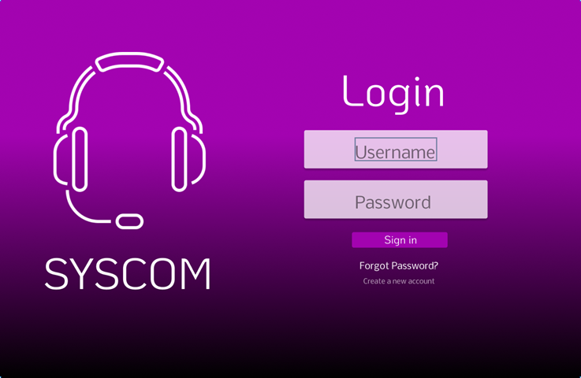

# Projeto-Pure

## [Clique aqui](https://github.com/biiaduartez/Projeto-Pure.git) para acessar o site

## **SOBRE**
- O site, ou melhor dizendo, a tela de login foi realizada utilizando o Framework Pure.CSS

-  Foi proposto um "desafio" pelo professor de FrontEnd com o intuito de compreendermos e aprender uma nova Framework de maneira idependente. Sendo assim, foi nos dado o objetivo de criar uma tela de login responsiva com o Pure.CSS

## **TECNOLOGIAS APLICADAS**

- HTML5
- CSS3
- Pure.CSS 
- Responsividade

## **FERRAMENTAS**

- VSCODE
- GITHUB / GIT
- FIGMA
- FLATICON

## **AUTORES**

- [Bianca Duarte]https://github.com/biiaduartez)
- [Caio Palermo](https://github.com/HasegawaTaizou)
- [Eduardo Ribeiro]https://github.com/Rib3r0)
